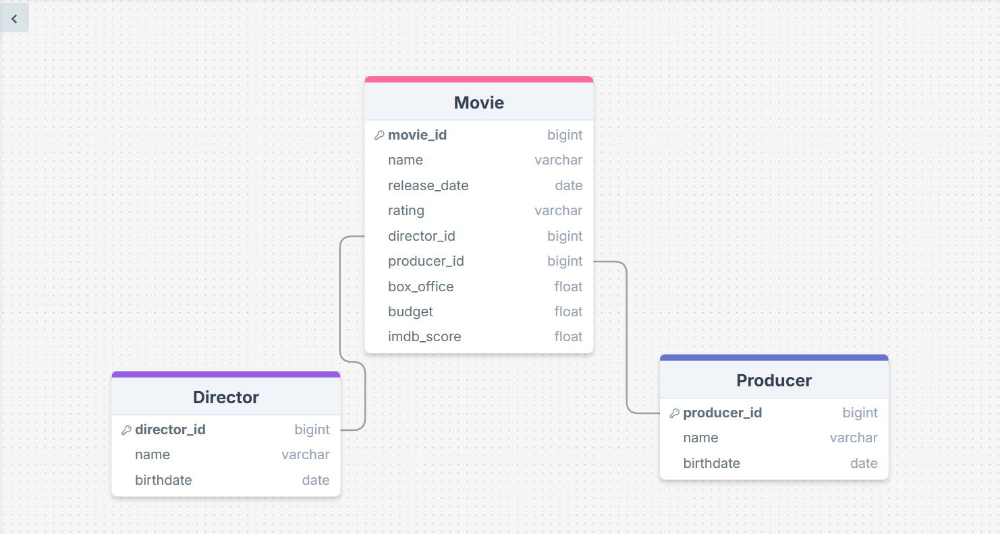

# Star Wars Movies

I simply created a database for every theatrical Star Wars film to date, along with their respective directors and producers.





## A Question that Worked:

**Question**: Which producer doesn't have a known birthdate?

**ChatGPT SQL Response**:
```sql

SELECT name
FROM producer
WHERE birth_date IS NULL;

```
**Raw Response**: [('Catherine Winder',)]

**Friendly Response**: Catherine Winder doesn't have a known birthdate.


## A Question that DIDN'T Work:

Actually, after a lot of tweaking in the code and editing in the database, I eventually was able to get all my queries to succeed. In other words, please ignore this part.


## Conclusion
Out of the three methods I chose (cross domain, single domain, and zero shot), I'm actually not sure which one is better. However, I did notice that while the answers I obtained from all three methods were mostly consistent, I did notice some variation in the responses I obtained, depending on the method used. Cross domain seems to be the most simplistic in its responses. Single domain is also very simplistic in its responses, but not quite as much as cross domain. Zero shot seems to be the only one that actually did the math for figuring out which Star Wars movie made the most money, as it was the only one to actually display the total profit that the movie made. I thought that was interesting. Overall, I'm honestly not sure which one is better. It's possible that one may be better in terms of performance, but it's honestly hard to tell, and each method seems to return the correct result. This has been an interesting project, and I learned quite a bit from it, both in terms of using AI to generate SQL code AND from researching the data regarding the Star Wars films and their directors. 

(Note: for simplicity's sake, I chose to limit my data to only include Star Wars films that had a theatrical release (The Ewoks movies and The Holiday Special are not included as they were direct-to-video releases, and The Mandalorian and Grogu was not included, as it hasn't come out yet. Also, TV shows are excluded from the data as well). I also chose to limit the number of producers to 1, also for simplicity's sake (technically, several Star Wars films had more than one producer. I just chose the one that most likely had top billing). I also did not adjust the budget and box office sales for inflation, which might affect the data. Speaking of the budget and box office sales, some of their values aren't actually definitive, nor do I distinguish between net and gross box office, or distinguish between global and local sales. I just chose the highest dollar amount given. In regards to release date, the data I chose refers to their commercial release in theatres, not their Hollywood premier, which occurred on an earlier date. Also, in regards to producer Catherine Windor, no matter how hard I tried, I couldn't find an actual birthdate for her, so I did not include it in my data. Credit for my research goes to Wikipedia and IMDB.)
